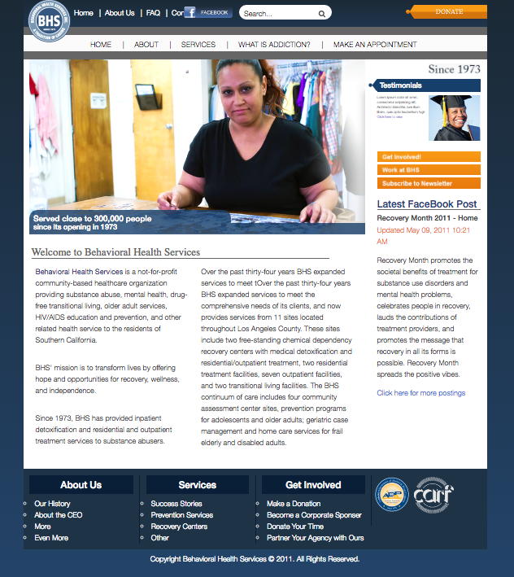

#GWDA313 Final Project

###Staging Site:
http://tapsdesignstudio.com/app 

###Team Members:
  * Lauren Tapley
  * Rosario Tinoco

##This site utilizes:
  * Github
  * Bootstrap
  * Sass
  * Compass
  * Bower
  * NPM
  * HTML5
  * CSS3
  * package.json
  * jquery
  * .gitignore
  * Gulp
  * Browser-sync

##To Install this Site:
  * Clone repository URL in GIT
  * Open the Terminal and type the following:
```
$ cd Desktop
```
  * Add repository to your computer
```
$ git clone [repository_url]
```
  * Move into the repository folder
```
$ cd [your_repository_folder_name]
```
  * Install dependencies using NPM
```
$ npm install
```
  * Type ` $ gulp ` into terminal and site will automatically launch localy using localhost:3000



